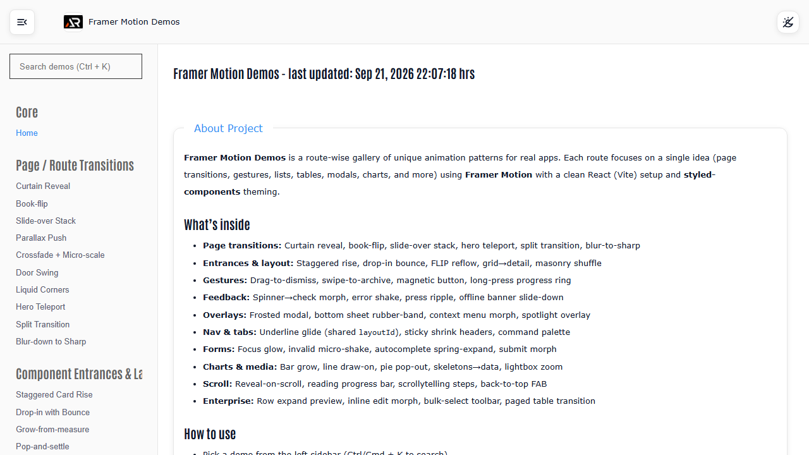

# Framer Motion Demos

A route-based React gallery of focused Framer Motion patterns for page transitions, gestures, forms, overlays, charts, scroll interactions, and enterprise UI.



## Features

- Lazy-loaded routes for focused interaction demos
- Searchable navigation with active-link scrolling
- Theme persistence, responsive fixed header, independent sidebar scroll, and floating go-to-top button
- Reusable React components with Framer Motion and styled-components
- Responsive icon-only footer with social and support links

## Tech stack

React, Vite, React Router, Framer Motion, styled-components, Material UI, and React Icons.

## Run locally

```bash
npm install
npm run dev
```

## Build and deploy

```bash
npm run lint
npm run build
npm run deploy
```

Live demo: [a2rp.github.io/framer-motion-demos](https://a2rp.github.io/framer-motion-demos/)

## Links

- Portfolio: [https://www.ashishranjan.net](https://www.ashishranjan.net)
- GitHub: [https://github.com/a2rp](https://github.com/a2rp)
- CodePen: [https://codepen.io/ash1198](https://codepen.io/ash1198)
- LinkedIn: [https://www.linkedin.com/in/aashishranjan](https://www.linkedin.com/in/aashishranjan)
- Facebook: [https://www.facebook.com/theash.ashish/](https://www.facebook.com/theash.ashish/)
- YouTube: [https://www.youtube.com/@ashishranjan-ashz?sub_confirmation=1](https://www.youtube.com/@ashishranjan-ashz?sub_confirmation=1)
- Email: [ash.ranjan09@gmail.com](mailto:ash.ranjan09@gmail.com)

## Support

- Support: [https://a2rp-donation-page.netlify.app/](https://a2rp-donation-page.netlify.app/)
- Buy Me a Coffee: [https://buymeacoffee.com/a2rp](https://buymeacoffee.com/a2rp)
- Patreon: [https://patreon.com/a2rp](https://patreon.com/a2rp)
